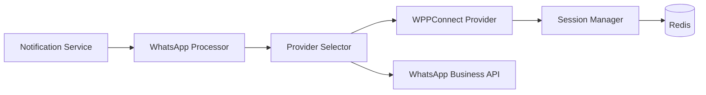

# Add WPPConnect Provider Support

## Architecture Overview

WPPConnect will be integrated as a new provider type in the existing provider architecture, following the same pattern as Twilio and SendGrid providers.



## Implementation Steps

### 0. Update Lookup System for All Providers

**Add Provider Lookup Types**

Update [`src/database/seeds/seed-lookup-types.ts`](src/database/seeds/seed-lookup-types.ts) to add provider-specific lookup types:

```typescript
{
  typeName: 'email_provider',
  description: 'Available email provider implementations',
},
{
  typeName: 'sms_provider',
  description: 'Available SMS provider implementations',
},
{
  typeName: 'fcm_provider',
  description: 'Available push notification provider implementations',
},
{
  typeName: 'whatsapp_provider',
  description: 'Available WhatsApp provider implementations',
},
{
  typeName: 'database_provider',
  description: 'Available database notification provider implementations',
}
```

**Add Provider Lookup Values**

Update [`src/database/seeds/seed-lookups.ts`](src/database/seeds/seed-lookups.ts) to add all provider implementations:

```typescript
// Email Providers
{
  type: 'email_provider',
  lookupCode: 'sendgrid',
  lookupValue: 'SendGrid',
  orderIndex: 1,
  metadata: { channel: 'email' }
},
{
  type: 'email_provider',
  lookupCode: 'ses',
  lookupValue: 'AWS SES',
  orderIndex: 2,
  metadata: { channel: 'email' }
},
{
  type: 'email_provider',
  lookupCode: 'mailgun',
  lookupValue: 'Mailgun',
  orderIndex: 3,
  metadata: { channel: 'email' }
},

// SMS Providers
{
  type: 'sms_provider',
  lookupCode: 'twilio',
  lookupValue: 'Twilio',
  orderIndex: 1,
  metadata: { channel: 'sms' }
},
{
  type: 'sms_provider',
  lookupCode: 'sns',
  lookupValue: 'AWS SNS',
  orderIndex: 2,
  metadata: { channel: 'sms' }
},

// FCM Providers
{
  type: 'fcm_provider',
  lookupCode: 'firebase',
  lookupValue: 'Firebase Cloud Messaging',
  orderIndex: 1,
  metadata: { channel: 'fcm' }
},
{
  type: 'fcm_provider',
  lookupCode: 'apn',
  lookupValue: 'Apple Push Notification',
  orderIndex: 2,
  metadata: { channel: 'fcm' }
},

// WhatsApp Providers (including new WPPConnect)
{
  type: 'whatsapp_provider',
  lookupCode: 'whatsapp-business',
  lookupValue: 'WhatsApp Business API',
  orderIndex: 1,
  metadata: { channel: 'whatsapp', official: true }
},
{
  type: 'whatsapp_provider',
  lookupCode: 'wppconnect',
  lookupValue: 'WPPConnect',
  orderIndex: 2,
  metadata: { channel: 'whatsapp', unofficial: true }
},

// Database Provider
{
  type: 'database_provider',
  lookupCode: 'database',
  lookupValue: 'Database Inbox',
  orderIndex: 1,
  metadata: { channel: 'database' }
}
```

**Why This Matters:**

- Provides a centralized registry of all available providers
- Allows dynamic UI generation for provider selection
- Enables validation of provider names in API requests
- Supports caching and efficient lookups via `LookupsService`
- Maintains consistency between code and database

### 1. Install Dependencies

Add `wppconnect` package to [`package.json`](package.json):

```bash
npm install @wppconnect-team/wppconnect
```

### 2. Define WPPConnect Credentials Interface

Extend [`src/common/providers/interfaces/credentials.interface.ts`](src/common/providers/interfaces/credentials.interface.ts) to add:

```typescript
export interface WPPConnectCredentials extends BaseWhatsAppCredentials {
  providerType: 'wppconnect';
  sessionName: string;
  autoClose?: number;
  disableWelcome?: boolean;
  // QR code configuration
  qrTimeout?: number;
  useChrome?: boolean;
}
```

Update the discriminated union:

```typescript
export type WhatsAppProviderCredentials = 
  | WhatsAppBusinessCredentials 
  | WPPConnectCredentials;
```

### 3. Create Session Manager Service

Create new file [`src/common/providers/implementations/whatsapp/session-manager.service.ts`](src/common/providers/implementations/whatsapp/session-manager.service.ts):

**Reference:** [WPPConnect - Creating Client](https://wppconnect.io/docs/tutorial/basics/creating-client)

This service manages WhatsApp Web sessions per tenant using the official WPPConnect API:

```typescript
import * as wppconnect from '@wppconnect-team/wppconnect';

// Create client with multi-session support
wppconnect.create({
  session: 'tenant-{tenantId}',
  catchQR: (base64Qrimg, asciiQR, attempts, urlCode) => {
    // Store QR in Redis for retrieval
  },
  statusFind: (statusSession, session) => {
    // Handle: isLogged, notLogged, qrReadSuccess, etc.
  },
  headless: true,
  useChrome: true,
  logQR: false,
  disableWelcome: true,
  autoClose: 60000,
  tokenStore: 'file',
  folderNameToken: './tokens'
})
```

**Key Features:**

- Session per tenant: `session: 'tenant-{tenantId}'`
- Store QR codes in Redis via `catchQR` callback
- Track session status via `statusFind` callback
- Store session tokens in configurable location
- Auto-reconnect on disconnect
- Phone connection verification with `client.startPhoneWatchdog()`

**Session States (from statusFind):**

- `isLogged` - User already authenticated
- `notLogged` - Need QR scan
- `qrReadSuccess` - QR scanned successfully
- `qrReadFail` - QR scan failed
- `browserClose` - Browser closed
- `autocloseCalled` - Auto-closed due to timeout
- `desconnectedMobile` - Mobile disconnected
- `deleteToken` - Token deleted

### 4. Implement WPPConnect Provider

Create [`src/common/providers/implementations/whatsapp/wppconnect.provider.ts`](src/common/providers/implementations/whatsapp/wppconnect.provider.ts):

**Reference:** [WPPConnect - Basic Functions](https://wppconnect.io/docs/tutorial/basics/basic-functions)

Extend `BaseProvider<WPPConnectCredentials>` with official WPPConnect methods:

**Core Methods:**

- `send()`: Handle different message types using WPPConnect client
- `validate()`: Check session status via `client.getConnectionState()`
- `formatPayload()`: Convert generic payload to WPPConnect format
- `getRequiredCredentials()`: Return `['sessionName', 'phoneNumberId']`
- `getChannel()`: Return `'whatsapp'`
- `getProviderName()`: Return `'wppconnect'`
- `getMetadata()`: Provider metadata with supported features

**Message Sending (WPPConnect API):**

```typescript
// Text message
await client.sendText(recipient.phone, content.body);

// Media message (image, video, document)
await client.sendFileFromBase64(
  recipient.phone,
  base64Data,
  filename,
  caption
);

// Location message
await client.sendLocation(
  recipient.phone,
  latitude,
  longitude,
  locationName
);

// Contact/vCard message
await client.sendContactVcard(
  recipient.phone,
  contactId,
  contactName
);
```

**Message Receiving (for status updates):**

**Reference:** [WPPConnect - Receiving Messages](https://wppconnect.io/docs/tutorial/basics/receiving-messages)

```typescript
client.onMessage((message) => {
  // Handle incoming messages/status updates
});

client.onAck((ack) => {
  // Handle message acknowledgments
  // ack.ack: 1=sent, 2=delivered, 3=read
});
```

**Session Management:**

- Get client from SessionManager for tenant
- Initialize on first send if not exists
- Handle QR authentication flow automatically
- Use `client.startPhoneWatchdog()` to monitor connection

### 5. Update Provider Types

Update [`src/common/providers/types.ts`](src/common/providers/types.ts) to include WPPConnect in available providers.

### 6. Register Provider

Update [`src/common/providers/registry/provider.registry.ts`](src/common/providers/registry/provider.registry.ts):

```typescript
import { WPPConnectProvider } from '../implementations/whatsapp/wppconnect.provider';

// In registerAllProviders():
this.factory.register('wppconnect', WPPConnectProvider);
```

### 7. Update WhatsApp Processor

Modify [`src/processors/whatsapp.processor.ts`](src/processors/whatsapp.processor.ts):

- Remove TODO placeholder code
- Implement actual provider selection and message sending
- Add support for different content types (text, media, location, contacts)
- Handle provider-specific metadata and options

### 8. Create WPPConnect Webhooks

Create [`src/modules/webhooks/controllers/wppconnect-webhook.controller.ts`](src/modules/webhooks/controllers/wppconnect-webhook.controller.ts):

**Endpoints:**

- `GET /webhooks/wppconnect/qr/:tenantId`: Get QR code for session setup
- `GET /webhooks/wppconnect/session/:tenantId`: Check session status
- `POST /webhooks/wppconnect/session/:tenantId/disconnect`: Disconnect session

**Status Event Handling (via client.onAck):**

**Reference:** [WPPConnect - Receiving Messages](https://wppconnect.io/docs/tutorial/basics/receiving-messages)

```typescript
// In SessionManager, set up event listeners
client.onAck((ack) => {
  // ack.ack values:
  // 1 = sent to server
  // 2 = delivered to recipient
  // 3 = read by recipient
  
  switch(ack.ack) {
    case 1: updateNotificationStatus(ack.id, 'sent'); break;
    case 2: updateNotificationStatus(ack.id, 'delivered'); break;
    case 3: updateNotificationStatus(ack.id, 'read'); break;
  }
});

// Monitor connection state
client.onStateChange((state) => {
  // States: CONFLICT, CONNECTED, DEPRECATED_VERSION, OPENING, 
  //         PAIRING, PROXYBLOCK, SMB_TOS_BLOCK, TIMEOUT, TOS_BLOCK, 
  //         UNLAUNCHED, UNPAIRED, UNPAIRED_IDLE
  
  if (['CONFLICT', 'UNPAIRED', 'TIMEOUT'].includes(state)) {
    handleSessionFailure(tenantId);
  }
});
```

**QR Code Retrieval:**

QR codes are stored in Redis with key `wppconnect:qr:{tenantId}` and TTL of 60 seconds. Endpoint returns:

```json
{
  "qrCode": "base64-encoded-image",
  "asciiQR": "terminal-qr-code",
  "urlCode": "qr-data-ref",
  "expiresAt": "2026-01-08T10:05:00Z",
  "attempts": 1
}
```

### 9. Update Webhooks Module

Update [`src/modules/webhooks/webhooks.module.ts`](src/modules/webhooks/webhooks.module.ts):

- Import and register `WPPConnectWebhookController`
- Inject `SessionManagerService`

### 10. Environment Variables

Add to [`env.example`](env.example):

```bash
# --- WPPConnect Provider ---
# WPPConnect WhatsApp Web client for multi-tenant messaging
# Docs: https://wppconnect.io/docs/tutorial/basics/creating-client
WHATSAPP_WPPCONNECT_ENABLED=false
WHATSAPP_WPPCONNECT_SESSION_NAME=notification-service
WHATSAPP_WPPCONNECT_AUTO_CLOSE=60000
WHATSAPP_WPPCONNECT_QR_TIMEOUT=60000
WHATSAPP_WPPCONNECT_USE_CHROME=true
WHATSAPP_WPPCONNECT_DISABLE_WELCOME=true
WHATSAPP_WPPCONNECT_TOKEN_STORE=file
WHATSAPP_WPPCONNECT_TOKEN_FOLDER=./tokens/wppconnect
```

### 11. Update Configuration

Update [`src/config/configuration.ts`](src/config/configuration.ts) and [`src/config/configuration.types.ts`](src/config/configuration.types.ts):

Add WPPConnect configuration section under `providers.whatsapp`:

```typescript
wppconnect: {
  enabled: process.env.WHATSAPP_WPPCONNECT_ENABLED === 'true',
  sessionName: process.env.WHATSAPP_WPPCONNECT_SESSION_NAME,
  autoClose: parseInt(process.env.WHATSAPP_WPPCONNECT_AUTO_CLOSE || '3600000'),
  qrTimeout: parseInt(process.env.WHATSAPP_WPPCONNECT_QR_TIMEOUT || '60000'),
  useChrome: process.env.WHATSAPP_WPPCONNECT_USE_CHROME === 'true',
  disableWelcome: process.env.WHATSAPP_WPPCONNECT_DISABLE_WELCOME === 'true',
  tokenStore: process.env.WHATSAPP_WPPCONNECT_TOKEN_STORE || 'file',
  folderNameToken: process.env.WHATSAPP_WPPCONNECT_TOKEN_FOLDER || './tokens/wppconnect',
}
```

**Logger Configuration:**

**Reference:** [WPPConnect - Configuring Logger](https://wppconnect.io/docs/tutorial/basics/configuring-logger)

Use WPPConnect's default logger (winston-based) without custom configuration. To control log levels in different environments:

```typescript
// In development
wppconnect.defaultLogger.level = process.env.LOG_LEVEL || 'info';

// In production - reduce console noise
if (process.env.NODE_ENV === 'production') {
  wppconnect.defaultLogger.level = 'warn';
}
```

No need to create custom logger - WPPConnect handles logging internally.

### 12. Provider Seed Data

Update [`src/database/seeds/seed-providers.ts`](src/database/seeds/seed-providers.ts):

Add WPPConnect to `whatsappProviders` array:

```typescript
{
  name: 'wppconnect',
  channel: 'whatsapp',
  providerType: 'wppconnect',
  displayName: 'WPPConnect',
  isDefault: false,
  isActive: true,
  priority: 2,
  configuration: {
    sessionName: 'notification-service',
    autoClose: 3600000,
    qrTimeout: 60000,
    useChrome: true,
    disableWelcome: true,
    webhookUrl: '/webhooks/wppconnect',
  },
  description: 'WPPConnect WhatsApp Web client',
}
```

### 13. Provider DTO Updates

Update [`src/modules/providers/dto/provider.dto.ts`](src/modules/providers/dto/provider.dto.ts):

- Add validation for WPPConnect specific fields
- Support `wppconnect` as a valid provider type

### 14. Documentation

Update [`README.md`](README.md) with:

- WPPConnect setup instructions
- QR code authentication flow
- Session management guidelines
- Multi-tenant configuration examples
- Troubleshooting guide

## WPPConnect API Reference

Based on official documentation: https://wppconnect.io/

### Client Creation

```typescript
const client = await wppconnect.create({
  session: 'tenant-123',
  catchQR: (base64Qrimg, asciiQR, attempts, urlCode) => {},
  statusFind: (statusSession, session) => {},
  headless: true,
  useChrome: true,
  logQR: false,
  disableWelcome: true,
  autoClose: 60000,
  tokenStore: 'file',
  folderNameToken: './tokens'
});
```

### Sending Messages

```typescript
// Text
await client.sendText(phone, message);

// File from base64
await client.sendFileFromBase64(phone, base64, filename, caption);

// Location
await client.sendLocation(phone, lat, lng, name);

// Contact vCard
await client.sendContactVcard(phone, contactId, name);
```

### Event Listeners

```typescript
// Message acknowledgments
client.onAck((ack) => {
  // ack.ack: 1=sent, 2=delivered, 3=read
  // ack.id: message ID
});

// Incoming messages
client.onMessage((message) => {
  // Handle incoming messages
});

// State changes
client.onStateChange((state) => {
  // Monitor connection state
});
```

### Session Management

```typescript
// Check connection
const state = await client.getConnectionState();

// Start watchdog (monitors phone connection)
client.startPhoneWatchdog(30000); // 30s interval

// Stop watchdog
client.stopPhoneWatchdog();

// Close session
await client.close();
```

## Key Design Decisions

### Multi-Tenant Session Management

Each tenant will have their own WhatsApp session identified by `{tenantId}:{sessionName}`. Sessions are:

- Stored in Redis for distributed access
- Lazily initialized on first message send
- Automatically reconnected on disconnect
- Cached in memory for performance

### Message Type Detection

The provider will automatically detect message type based on payload structure:

- If `content.media` exists → media message
- If `content.location` exists → location message
- If `content.contact` exists → contact message
- Otherwise → text message

### QR Code Authentication Flow

1. Tenant sends first message via WPPConnect
2. If no session exists, provider initiates authentication
3. QR code is stored in Redis with expiration
4. Tenant retrieves QR code via `GET /webhooks/wppconnect/qr/:tenantId`
5. After scan, session is established and message is sent
6. Subsequent messages reuse the session

### Error Handling

- Connection errors → Mark as retryable, attempt reconnection
- Invalid phone number → Mark as failed, no retry
- Session timeout → Clear session, force re-authentication
- Rate limits → Implement exponential backoff

## Testing Strategy

1. **Unit Tests**: Provider methods, session manager, message formatters
2. **Integration Tests**: End-to-end message sending with mock WPPConnect client
3. **Manual Testing**: QR code flow, multi-tenant sessions, different message types

## Migration Path

Since WhatsApp functionality is not yet implemented, this is a greenfield implementation. No migration needed.

## Monitoring & Observability

Add metrics for:

- Active WPPConnect sessions count
- QR code generation rate
- Message send success/failure rate per provider
- Session reconnection events
- Average session lifetime

## Security Considerations

- Store session tokens encrypted in Redis
- Implement session timeout and auto-cleanup
- Validate tenant ownership before session access
- Rate limit QR code requests to prevent abuse
- Sanitize phone numbers and message content

## Implementation Notes

### Logger Configuration

Per the [WPPConnect logging documentation](https://wppconnect.io/docs/tutorial/basics/configuring-logger), we will use the default winston-based logger without custom configuration. The default logger level is `info`, which is appropriate for production use. No custom logger setup is needed as WPPConnect handles internal logging automatically.

### Token Storage

Sessions are stored using WPPConnect's built-in token storage with `tokenStore: 'file'`. This stores session data in the configured folder, allowing sessions to persist across application restarts. For production, tokens should be stored in a secure location with appropriate file permissions.

### Multi-Tenant Architecture

Each tenant gets a unique session name: `tenant-{tenantId}`. This ensures complete isolation between tenants' WhatsApp connections. The SessionManager service maintains a map of active clients and handles lazy initialization.