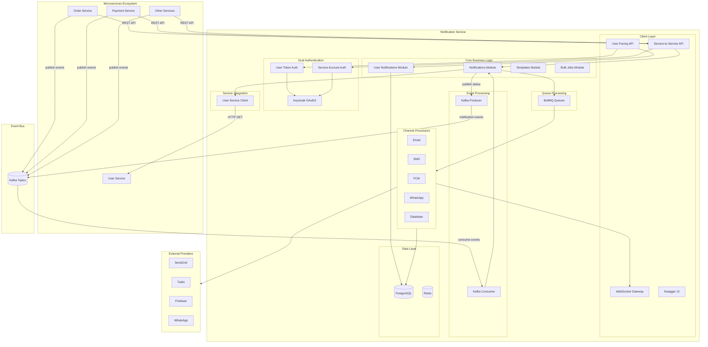
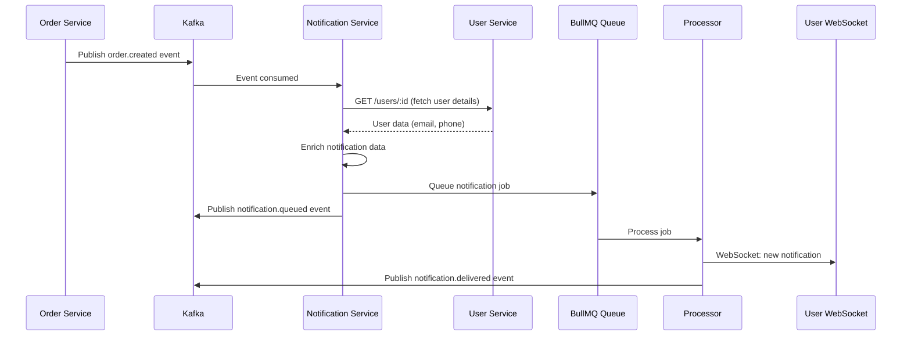
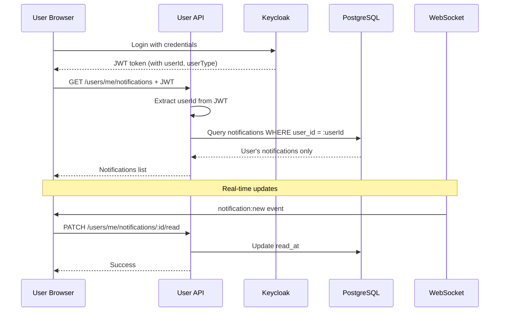
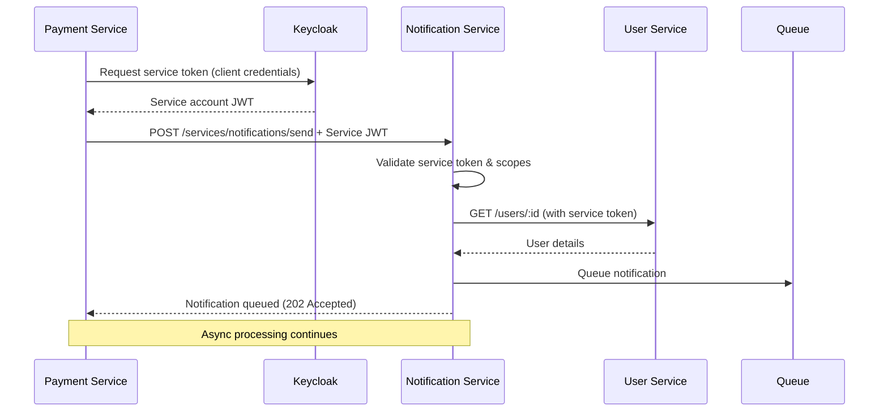

# Multi-Tenant Notification System Implementation Plan

## Architecture Overview - Microservices Context




## Key Microservices Features

### Hybrid Communication (REST + Events)

- **REST APIs**: Synchronous notification requests from other microservices
- Direct API calls for immediate notification sending
- Batch notification APIs with chunk support using batch IDs
- Status queries and management
- **Event-Driven**: Asynchronous notification triggering via Kafka
- **Inbound**: Consume events from other services (order.created, payment.completed)
- **Outbound**: Publish notification status events back to Kafka
- **Topics**: `order.created`, `payment.completed`, `notification.delivered`, etc.
- **Best Practices**:
- Use REST for synchronous, immediate needs and when response is required
- Use Events for fire-and-forget, eventual consistency scenarios

### Dual Authentication

- **User Tokens**: OAuth2/OIDC for user-facing APIs (manage own notifications)
- **Service Accounts**: Client credentials flow for service-to-service calls
- Both validated via Keycloak with different permission scopes

### User Service Integration

- Fetch user details (email, phone, preferences) via REST API
- Cache user data in Redis for performance
- Fallback to request data if User Service unavailable

### User Self-Service APIs

Users can manage their own notifications by userId and userType:

- View all their notifications
- Mark notifications as read/unread
- Delete their notifications
- Update notification preferences
- Send self-notifications (optional)

## Phase 1: Foundation & Infrastructure

### 1.1 Dependencies Installation

Install all required packages:

- **Core**: `@nestjs/config`, `@nestjs/swagger`, `@nestjs/platform-socket.io`, `@nestjs/axios`
- **Database**: `drizzle-orm`, `drizzle-kit`, `postgres`, `pg`
- **Queue**: `@nestjs/bullmq`, `bullmq`, `ioredis`
- **Auth**: `@nestjs/passport`, `passport`, `passport-jwt`, `jwks-rsa`, `@nestjs/jwt`, `@keycloak/keycloak-admin-client`
- **Events**: `kafkajs`, `@nestjs/microservices` (Kafka adapter)
- **Channels**: `@sendgrid/mail`, `twilio`, `firebase-admin`, `@whiskeysockets/baileys`
- **Utils**: `class-validator`, `class-transformer`, `winston`, `helmet`, `compression`, `handlebars`, `axios`

### 1.2 Environment Configuration

Create [`src/config/configuration.ts`](src/config/configuration.ts):

- App settings (port, host, environment)
- Database connection (PostgreSQL URL)
- Redis configuration
- Keycloak settings (realm, user client ID, service client ID, service client secret, JWKS URI)
- Kafka configuration (brokers, consumer group, topics)
- User Service configuration (base URL, timeout, retry policy)
- Channel provider credentials (SendGrid API key, Twilio credentials, FCM key, WhatsApp config)
- Queue settings (concurrency, retry policies)
- WebSocket configuration

### 1.3 Docker Compose Setup

Create [`docker-compose.yml`](docker-compose.yml):

- PostgreSQL 15 with persistent volume
- Redis 7 for BullMQ and caching
- Kafka with Zookeeper for event streaming
- Keycloak 23+ with PostgreSQL backend
- Optional: Kafka UI for monitoring, Adminer for database management

## Phase 2: Database Layer (Drizzle ORM)

### 2.1 Schema Definitions

Create schemas in [`src/database/schema/`](src/database/schema/):**Core tables**:

- `tenants.schema.ts` - Tenant management
- `lookup-types.schema.ts` - Lookup type definitions
- `lookups.schema.ts` - Lookup values with relations

**Notification tables**:

- `notification-templates.schema.ts` - Template management with versioning
- `notification-providers.schema.ts` - Channel provider configurations
- `notifications.schema.ts` - Main notifications table (includes batch_id for grouping)
- `notification-logs.schema.ts` - Delivery tracking logs
- `notification-batches.schema.ts` - Batch metadata for chunked sends
- `bulk-notification-jobs.schema.ts` - Bulk job tracking
- `bulk-notification-items.schema.ts` - Individual bulk items
- `notification-preferences.schema.ts` - User notification preferences

### 2.2 Drizzle Configuration

Create [`drizzle.config.ts`](drizzle.config.ts) and [`src/database/drizzle.module.ts`](src/database/drizzle.module.ts):

- Connection pooling configuration
- Migration path setup
- Schema export and relations

### 2.3 Migrations & RLS Policies

Create migrations in [`src/database/migrations/`](src/database/migrations/):

- Initial schema creation with all tables from ERD
- Indexes for performance (tenant_id, status, scheduled_at, created_at)
- Row-Level Security (RLS) policies for tenant isolation:
  ```sql
              CREATE POLICY tenant_isolation ON notifications 
              USING (tenant_id = current_setting('app.current_tenant_id')::BIGINT);
  ```


- Composite indexes for common query patterns
- Partitioning strategy for notifications table (by created_at)

### 2.4 Comprehensive Seeders

Create [`src/database/seeds/`](src/database/seeds/) and [`src/scripts/keycloak-setup/`](src/scripts/keycloak-setup/):**Keycloak Setup (via Keycloak Admin REST API)**:

- `keycloak-seeder.service.ts` - Keycloak admin client wrapper
- `seed-keycloak-roles.ts` - Create application roles:
- `notification-admin` - Full administrative access
- `notification-manager` - Manage templates and providers
- `notification-user` - User self-service capabilities
- `notification-service` - Service-to-service calls
- `notification-viewer` - Read-only access
- `seed-keycloak-users.ts` - Create default users:
- Super admin user with all roles
- Test users with different roles
- Service accounts for each microservice (Order Service, Payment Service, etc.)
- `seed-keycloak-clients.ts` - Configure clients:
- User-facing client (public, authorization code flow)
- Service clients with client credentials

**Database Seeders**:

- `seed-lookup-types.ts` - System lookup types:
- `notification_status`: pending, queued, sent, delivered, failed, bounced, read
- `notification_priority`: low, medium, high, urgent
- `notification_channel`: email, sms, fcm, whatsapp, database
- `template_type`: transactional, marketing, system, alert
- `user_type`: admin, customer, vendor, driver, support, guest
- `batch_status`: pending, processing, completed, failed, cancelled
- `seed-lookups.ts` - Default lookup values with metadata
- `seed-tenants.ts` - Create default tenant(s):
- Development tenant with settings
- Tenant admin user mapping
- `seed-templates.ts` - Essential templates:
- Welcome email template
- Password reset template
- Order confirmation template
- Payment receipt template
- System notification template
- `seed-providers.ts` - Default provider configurations (with placeholder credentials)
- `seed-test-data.ts` - Sample notifications for development (optional)

**Seeder Orchestration**:

- `seed.ts` - Main seeder orchestrator
- Run order: Keycloak roles → Keycloak users → Lookup types → Lookups → Tenants → Templates → Providers
- Idempotent seeders (check if exists before creating)
- CLI command: `npm run seed` or `npm run seed:reset` (drop and reseed)

### 2.5 Seeder Implementation Details

**Keycloak Admin Client Setup**:Create [`src/modules/keycloak-admin/keycloak-admin.service.ts`](src/modules/keycloak-admin/keycloak-admin.service.ts):

- Use `@keycloak/keycloak-admin-client` package
- Authenticate with admin credentials
- CRUD operations for roles, users, clients

**Environment Variables for Seeding**:

```env
KEYCLOAK_ADMIN_CLIENT_ID=admin-cli
KEYCLOAK_ADMIN_USERNAME=admin
KEYCLOAK_ADMIN_PASSWORD=admin

# Default users to create
SEED_ADMIN_EMAIL=admin@notification.local
SEED_ADMIN_PASSWORD=Admin123!
SEED_TEST_USER_EMAIL=user@test.com
SEED_TEST_USER_PASSWORD=User123!

# Service accounts
SEED_SERVICE_ORDER_CLIENT_ID=order-service
SEED_SERVICE_PAYMENT_CLIENT_ID=payment-service
```

**Keycloak Seeder Flow**:

1. Connect to Keycloak Admin API
2. Check if realm exists, create if needed
3. Create realm roles with descriptions
4. Create client scopes for different services
5. Create user-facing client (public)
6. Create service account clients with credentials
7. Assign roles to service accounts
8. Create admin and test users
9. Assign roles to users

**Database Seeder Flow**:

1. Check database connection
2. Seed lookup types (system-level)
3. Seed lookup values
4. Create default tenant(s)
5. Create default notification templates
6. Create default provider configurations (with empty credentials for manual setup)
7. Optional: Create test notifications

**Idempotency Strategy**:

- Check for existing records before insertion
- Use upsert patterns where appropriate
- Log skipped items
- Return summary of created/skipped items

**CLI Commands**:

```bash
npm run seed              # Run all seeders
npm run seed:keycloak     # Only Keycloak seeders
npm run seed:database     # Only database seeders
npm run seed:reset        # Drop all data and reseed
npm run seed:status       # Check what's seeded
```


## Phase 3: Authentication & Authorization

### 3.1 Keycloak Integration - Dual Authentication

Implement in [`src/modules/auth/`](src/modules/auth/):**User Token Strategy**:

- `strategies/keycloak-user.strategy.ts` - JWT validation for user tokens
- Validates tokens from user-facing API calls
- Extracts userId, tenantId, userType, roles from claims

**Service Account Strategy**:

- `strategies/keycloak-service.strategy.ts` - JWT validation for service-to-service calls
- Validates client credentials tokens from other microservices
- Extracts service name, allowed scopes from claims
- Different permission model than user tokens

**Shared Components**:

- `guards/keycloak-auth.guard.ts` - Smart guard that uses appropriate strategy
- `guards/service-auth.guard.ts` - Service-only endpoints guard
- `decorators/public.decorator.ts` - Mark public endpoints
- `decorators/current-user.decorator.ts` - Extract user from JWT
- `decorators/current-service.decorator.ts` - Extract service identity
- `decorators/current-tenant.decorator.ts` - Extract tenant from context
- `decorators/roles.decorator.ts` - Role-based access control
- `decorators/scopes.decorator.ts` - Scope-based access for services

### 3.2 Tenant Context Middleware

Create [`src/common/middleware/tenant-context.middleware.ts`](src/common/middleware/tenant-context.middleware.ts):

- Extract tenant_id from JWT claims
- Set PostgreSQL session variable for RLS
- Validate tenant access permissions

### 3.3 Swagger OAuth2 Setup

Update [`src/main.ts`](src/main.ts):

- Configure Swagger with OAuth2 authorization code flow
- Add security schemes for both user and service authentication
- Create OAuth2 redirect endpoint controller
- Document all endpoints with `@ApiBearerAuth()` or `@ApiSecurity('service-account')`

### 3.4 Kafka Event Integration

Create [`src/modules/events/`](src/modules/events/):**Event Consumer**:

- `events.module.ts` - Kafka microservice configuration
- `event-consumer.service.ts` - Listen to events from other services
- `handlers/order-event.handler.ts` - Handle order-related events
- `handlers/payment-event.handler.ts` - Handle payment events
- `handlers/user-event.handler.ts` - Handle user lifecycle events

**Event Topics to Consume**:

- `order.created` → Send order confirmation notification
- `order.shipped` → Send shipping notification
- `payment.completed` → Send payment receipt
- `payment.failed` → Send payment failure alert
- `user.registered` → Send welcome notification
- `user.password-reset` → Send reset link

**Event Producer**:

- `event-producer.service.ts` - Publish notification events
- Publish to topics: `notification.queued`, `notification.sent`, `notification.delivered`, `notification.failed`, `notification.read`

**Event DTOs**:

- `dto/incoming-events/*.dto.ts` - DTOs for consumed events
- `dto/outgoing-events/*.dto.ts` - DTOs for published events
- Validation using class-validator

**Configuration**:

- Kafka broker URLs
- Consumer group ID: `notification-service`
- Auto-commit offset strategy
- Retry policy for failed event processing
- Dead letter topic for unprocessable events

### 3.5 User Service Client Integration

Create [`src/modules/user-service/`](src/modules/user-service/):**HTTP Client**:

- `user-service.module.ts` - HTTP module configuration
- `user-service.client.ts` - REST API client for User Service
- Endpoints to call:
- `GET /users/:id` - Fetch user by ID
- `GET /users/by-type/:type` - Fetch users by type
- `POST /users/search` - Batch user lookup
- `GET /users/:id/preferences` - Get user notification preferences

**Caching Layer**:

- Redis cache for user data (TTL: 5 minutes)
- Cache invalidation on user.updated events from Kafka
- Fallback to request data if User Service unavailable

**DTOs**:

- `user-response.dto.ts` - User data structure
- `user-search.dto.ts` - Search parameters
- `user-preferences.dto.ts` - User preferences

**Error Handling**:

- Retry logic with exponential backoff (3 attempts)
- Circuit breaker pattern for User Service failures
- Graceful degradation: use provided recipient data if service down
- Log all User Service failures for monitoring

**Service Account Authentication**:

- Use Keycloak service account token for requests
- Token refresh handling
- Request timeout: 5 seconds

## Phase 4: Core Business Modules

### 4.1 Tenants Module

[`src/modules/tenants/`](src/modules/tenants/):

- DTOs: CreateTenantDto, UpdateTenantDto, TenantResponseDto
- Service: CRUD operations, settings management
- Controller: Tenant administration endpoints
- Repository: Drizzle queries with tenant isolation

### 4.2 Lookups Module

[`src/modules/lookups/`](src/modules/lookups/):

- DTOs: CreateLookupDto, UpdateLookupDto
- Service: Dynamic lookup management, caching
- Controller: `GET /api/v1/lookups/{type}`, `POST /api/v1/lookups/{type}`
- Cache layer using Redis for frequently accessed lookups

### 4.3 Templates Module

[`src/modules/templates/`](src/modules/templates/):

- DTOs: CreateTemplateDto, UpdateTemplateDto, TemplateResponseDto
- Service: Template CRUD, versioning, variable validation
- Controller: Full CRUD endpoints with filtering
- Template engine: Handlebars for variable substitution
- Preview functionality with sample data

### 4.4 Providers Module

[`src/modules/providers/`](src/modules/providers/):

- DTOs: CreateProviderDto, UpdateProviderDto
- Service: Provider configuration, credential encryption, fallback management
- Controller: Provider CRUD endpoints
- Credential encryption using AES-256-GCM

### 4.5 Notifications Module (Service-to-Service)

[`src/modules/notifications/`](src/modules/notifications/):**Purpose**: Service-facing APIs for other microservices to send notifications**DTOs**:

- `send-notification.dto.ts` - Single/batch send request (from services)
- `notification-response.dto.ts` - Response format
- `notification-query.dto.ts` - Filtering and pagination (admin)

**Services**:

- `notifications.service.ts` - Main orchestration
- `notification-processor.service.ts` - Queue job creation
- `notification-validator.service.ts` - Recipient and content validation
- `user-enrichment.service.ts` - Fetch user details from User Service

**Controllers**:

- `notifications.controller.ts` - Service-facing endpoints (requires service auth)
- Endpoints:
- `POST /api/v1/services/notifications/send` - Send single notification
- `POST /api/v1/services/notifications/send-batch` - Send multiple notifications (auto-generates batch_id)
- `POST /api/v1/services/notifications/send-chunk` - Send chunk of notifications with existing batch_id
- `GET /api/v1/services/notifications/batches/:batchId` - Get batch status and statistics
- `GET /api/v1/services/notifications/batches/:batchId/notifications` - List notifications in batch
- `POST /api/v1/services/notifications/bulk` - Bulk send from services
- `GET /api/v1/admin/notifications` - Admin: list all notifications
- `GET /api/v1/admin/notifications/:id` - Admin: get details

**Batch Chunking Feature**:

- **Use Case**: When sending large batches, split into chunks for progressive processing
- **Flow**:

1. Service creates batch via `/send-batch` → returns `batch_id` and `batch_token`
2. Service sends chunks via `/send-chunk` with same `batch_id` and `batch_token`
3. System tracks: total notifications, processed count, success/failure per batch
4. Query batch status anytime via `/batches/:batchId`

- **Batch Metadata Table**: `notification_batches`
- batch_id (UUID)
- batch_token (for authentication)
- total_expected (nullable, updated as chunks arrive)
- total_sent, total_delivered, total_failed
- status (pending, processing, completed)
- created_by (service name)
- **Benefits**:
- Progressive sending without loading entire dataset
- Resilient to network interruptions
- Track partial completion
- Continue from failure point

**Integration with Events**:

- Consume events from Kafka and trigger notifications
- Enrich recipient data from User Service
- Queue notifications to appropriate channels
- Publish batch completion events

### 4.6 User Notifications Module (User-Facing)

[`src/modules/user-notifications/`](src/modules/user-notifications/):**Purpose**: User-facing APIs for users to manage their own notifications**DTOs**:

- `user-notification-query.dto.ts` - Filter own notifications
- `mark-read.dto.ts` - Mark notifications as read
- `notification-preference.dto.ts` - Manage preferences

**Services**:

- `user-notifications.service.ts` - User notification management
- Enforce userId and userType filtering from JWT token
- Only allow users to access their own notifications

**Controllers**:

- `user-notifications.controller.ts` - User-facing endpoints (requires user auth)
- Endpoints:
- `GET /api/v1/users/me/notifications` - Get my notifications
    - Query params: status, channel, dateFrom, dateTo, limit, offset
    - Automatically filtered by userId from JWT
- `GET /api/v1/users/me/notifications/:id` - Get my notification details
    - Verify notification belongs to authenticated user
- `PATCH /api/v1/users/me/notifications/:id/read` - Mark as read
- `PATCH /api/v1/users/me/notifications/:id/unread` - Mark as unread
- `DELETE /api/v1/users/me/notifications/:id` - Delete my notification
- `DELETE /api/v1/users/me/notifications` - Delete multiple notifications
- `GET /api/v1/users/me/notifications/unread-count` - Get unread count
- `POST /api/v1/users/me/notifications/mark-all-read` - Mark all as read

**Security**:

- Extract userId, userType from JWT token
- Apply RLS policies at database level
- Application-level validation: user can only access own data
- Rate limiting per user

**WebSocket Integration**:

- Real-time notification delivery to user's connected socket
- Acknowledge read status via WebSocket

### 4.7 User Preferences Module

[`src/modules/preferences/`](src/modules/preferences/):**Endpoints**:

- `GET /api/v1/users/me/preferences` - Get my notification preferences
- `PUT /api/v1/users/me/preferences` - Update my preferences
- `PUT /api/v1/users/me/preferences/channels/:channel` - Enable/disable channel

**Features**:

- Channel preferences (email, SMS, FCM, WhatsApp, database)
- Quiet hours configuration
- Do Not Disturb mode
- Frequency limits per channel
- Topic-based preferences (marketing, transactional, system)

### 4.8 Bulk Jobs Module

[`src/modules/bulk-jobs/`](src/modules/bulk-jobs/):

- CSV upload handler using `multer`
- CSV parser with validation
- Chunk processing (1000 records per batch)
- Job status tracking
- Progress reporting via WebSocket
- Enrich user data from User Service for CSV uploads
- Endpoints:
- `POST /api/v1/services/notifications/bulk/csv` - Upload CSV (service auth)
- `GET /api/v1/services/notifications/bulk/:jobId` - Job status
- `GET /api/v1/services/notifications/bulk/:jobId/items` - Item details
- `DELETE /api/v1/services/notifications/bulk/:jobId` - Cancel job

## Phase 5: Queue System (BullMQ)

### 5.1 Queue Configuration

[`src/queues/queue.module.ts`](src/queues/queue.module.ts):

- Configure BullMQ with Redis
- Define queue names per channel
- Set up retry strategies (exponential backoff)
- Dead letter queue for failed jobs
- Rate limiting per tenant

### 5.2 Queue Definitions

Create separate queues:

- `email.queue.ts` - Email delivery queue
- `sms.queue.ts` - SMS delivery queue
- `fcm.queue.ts` - FCM push notification queue
- `whatsapp.queue.ts` - WhatsApp message queue
- `database.queue.ts` - Database notification queue

### 5.3 Job Schemas

Define job payloads:

```typescript
interface NotificationJob {
  notificationId: string;
  tenantId: string;
  channel: string;
  recipient: RecipientInfo;
  content: MessageContent;
  priority: string;
  metadata: Record<string, unknown>;
}
```


## Phase 6: Channel Processors

### 6.1 Email Processor

[`src/processors/email.processor.ts`](src/processors/email.processor.ts):

- **Primary**: SendGrid integration
- **Fallback**: SMTP using `nodemailer`
- HTML template rendering
- Attachment handling
- Bounce/delivery webhook handling
- Open/click tracking

### 6.2 SMS Processor

[`src/processors/sms.processor.ts`](src/processors/sms.processor.ts):

- **Primary**: Twilio integration
- **Fallback**: AWS SNS
- Phone number validation and formatting
- Character count and message splitting
- Delivery status callbacks

### 6.3 FCM Processor

[`src/processors/fcm.processor.ts`](src/processors/fcm.processor.ts):

- Firebase Admin SDK integration
- Device token management
- Payload construction (notification + data)
- Topic-based messaging support
- Token refresh handling

### 6.4 WhatsApp Processor

[`src/processors/whatsapp.processor.ts`](src/processors/whatsapp.processor.ts):

- WhatsApp Business API integration
- Template message support
- Media message handling
- Session management

### 6.5 Database Processor

[`src/processors/database.processor.ts`](src/processors/database.processor.ts):

- Store notification in database for in-app display
- Trigger WebSocket event for real-time delivery
- Mark as unread
- Badge count update

### 6.6 Base Processor

Create [`src/processors/base.processor.ts`](src/processors/base.processor.ts):

- Common retry logic
- Error handling and logging
- Status update methods
- Circuit breaker pattern for provider failures

## Phase 7: WebSocket Gateway

### 7.1 Notification Gateway

[`src/gateways/notification.gateway.ts`](src/gateways/notification.gateway.ts):

- WebSocket connection handling
- Authentication via JWT token
- Room management (user-specific, tenant-specific)
- Events:
- `notification:new` - New notification for user
- `notification:status` - Status update
- `bulk-job:progress` - Bulk job progress
- `notification:read` - Mark as read acknowledgment

### 7.2 WebSocket Authentication

- Extract JWT from handshake query
- Validate token using Keycloak strategy
- Join user-specific room on connection
- Disconnect on invalid token

## Phase 8: Webhooks

### 8.1 Outgoing Webhooks (Client)

[`src/modules/webhooks/webhook-client.service.ts`](src/modules/webhooks/webhook-client.service.ts):

- Send delivery status updates to tenant webhook URLs
- Retry logic with exponential backoff
- Signature generation (HMAC-SHA256)
- Webhook endpoint validation
- Events to send:
- `notification.queued`
- `notification.sent`
- `notification.delivered`
- `notification.failed`
- `notification.read`

### 8.2 Incoming Webhooks (Server)

Create webhook receivers:

- `sendgrid-webhook.controller.ts` - SendGrid events
- `twilio-webhook.controller.ts` - Twilio delivery status
- `fcm-webhook.controller.ts` - FCM token refresh
- `whatsapp-webhook.controller.ts` - WhatsApp status updates

Implement:

- Signature verification for each provider
- Event parsing and normalization
- Notification status updates
- Idempotency handling

## Phase 9: Logging & Monitoring

### 9.1 Logger Configuration

[`src/common/logger/logger.module.ts`](src/common/logger/logger.module.ts):

- Winston logger with multiple transports
- Structured JSON logging
- Log levels per environment
- Contextual logging with tenant/user info
- Request/response logging middleware
- Log rotation and archival

### 9.2 Monitoring

Implement metrics collection:

- Prometheus metrics exporter
- Custom metrics:
- Notifications sent per channel
- Delivery success rate
- Queue depth
- Processing time
- Provider failure rate
- Health check endpoint: `GET /health`

### 9.3 Error Handling

[`src/common/filters/`](src/common/filters/):

- `http-exception.filter.ts` - HTTP error handler
- `all-exceptions.filter.ts` - Global exception handler
- Structured error responses
- Error logging with stack traces

## Phase 10: Rate Limiting & Security

### 10.1 Rate Limiting

[`src/common/guards/rate-limit.guard.ts`](src/common/guards/rate-limit.guard.ts):

- Redis-based rate limiting
- Per-tenant limits
- Per-endpoint limits
- Sliding window algorithm
- Rate limit headers in response

### 10.2 Security Middleware

- Helmet for security headers
- CORS configuration
- Request size limits
- Input sanitization
- SQL injection prevention (Drizzle handles this)

### 10.3 Encryption Service

[`src/common/services/encryption.service.ts`](src/common/services/encryption.service.ts):

- Provider credential encryption
- Secure key management
- Encryption at rest for sensitive fields

## Phase 11: API Endpoints Implementation

### Complete API Coverage - Microservices Architecture

**User-Facing APIs** (`/api/v1/users/me/*`) - Requires User Authentication:

- ✅ `GET /users/me/notifications` - List my notifications
- ✅ `GET /users/me/notifications/:id` - Get notification details
- ✅ `PATCH /users/me/notifications/:id/read` - Mark as read
- ✅ `PATCH /users/me/notifications/:id/unread` - Mark as unread
- ✅ `DELETE /users/me/notifications/:id` - Delete notification
- ✅ `DELETE /users/me/notifications` - Bulk delete
- ✅ `GET /users/me/notifications/unread-count` - Unread count
- ✅ `POST /users/me/notifications/mark-all-read` - Mark all read
- ✅ `GET /users/me/preferences` - Get preferences
- ✅ `PUT /users/me/preferences` - Update preferences

**Service-to-Service APIs** (`/api/v1/services/*`) - Requires Service Authentication:

- ✅ `POST /services/notifications/send` - Send single notification
- ✅ `POST /services/notifications/send-batch` - Send batch (returns batch_id)
- ✅ `POST /services/notifications/send-chunk` - Send chunk with existing batch_id
- ✅ `GET /services/notifications/batches/:batchId` - Get batch status
- ✅ `GET /services/notifications/batches/:batchId/notifications` - List batch notifications
- ✅ `POST /services/notifications/bulk` - Bulk send
- ✅ `POST /services/notifications/bulk/csv` - CSV upload
- ✅ `GET /services/notifications/bulk/:jobId` - Job status
- ✅ `DELETE /services/notifications/bulk/:jobId` - Cancel job

**Admin APIs** (`/api/v1/admin/*`) - Requires Admin Role:

- ✅ Templates: CRUD operations, preview
- ✅ Providers: CRUD operations, test connection
- ✅ Lookups: dynamic lookup management
- ✅ Tenants: tenant management
- ✅ Notifications: view all notifications across tenants
- ✅ Webhook configuration per tenant

**Public/System APIs**:

- ✅ Health check: `GET /health`
- ✅ Metrics: `GET /metrics` (Prometheus format)
- ✅ Webhook receivers: `POST /webhooks/:provider` (SendGrid, Twilio, etc.)

**Event-Driven Integration**:

- ✅ Kafka consumer for incoming events
- ✅ Kafka producer for notification status events

### API Documentation

- Comprehensive Swagger documentation with security schemes
- Separate tags for: Users, Services, Admin, System
- Request/response examples for each endpoint
- Authentication flow documentation (user OAuth2 + service client credentials)
- Event schema documentation
- Webhook payload examples

### Batch Chunking API Usage Examples

**Example 1: Creating a new batch and sending chunks**

```typescript
// Step 1: Create batch (first chunk)
POST /api/v1/services/notifications/send-batch
Authorization: Bearer {service-token}
Content-Type: application/json

{
  "notifications": [
    {
      "channel": "email",
      "recipientUserId": "user_001",
      "recipientUserType": "customer",
      "subject": "Order Confirmation",
      "body": "Your order has been confirmed"
    },
    // ... more notifications (chunk 1)
  ],
  "totalExpected": 10000  // optional: total across all chunks
}

// Response:
{
  "batchId": "batch_abc123",
  "batchToken": "token_xyz789",
  "chunkProcessed": 1000,
  "totalProcessed": 1000,
  "message": "Batch created and first chunk queued"
}

// Step 2: Send additional chunks
POST /api/v1/services/notifications/send-chunk
Authorization: Bearer {service-token}
Content-Type: application/json

{
  "batchId": "batch_abc123",
  "batchToken": "token_xyz789",
  "notifications": [
    // ... next chunk of notifications
  ]
}

// Step 3: Check batch status
GET /api/v1/services/notifications/batches/batch_abc123
Authorization: Bearer {service-token}

// Response:
{
  "batchId": "batch_abc123",
  "status": "processing",
  "totalExpected": 10000,
  "totalSent": 8500,
  "totalDelivered": 8200,
  "totalFailed": 300,
  "createdAt": "2026-01-08T10:00:00Z",
  "updatedAt": "2026-01-08T10:15:00Z"
}
```

**Example 2: Progressive sending from external system**

```typescript
// Order Service sending notifications progressively as orders are processed
async function sendOrderNotifications(orders: Order[]) {
  const CHUNK_SIZE = 500;
  let batchId: string;
  let batchToken: string;
  
  for (let i = 0; i < orders.length; i += CHUNK_SIZE) {
    const chunk = orders.slice(i, i + CHUNK_SIZE);
    const notifications = chunk.map(order => ({
      channel: 'email',
      recipientUserId: order.customerId,
      recipientUserType: 'customer',
      subject: `Order ${order.id} Confirmation`,
      body: `Thank you for your order!`,
      metadata: { orderId: order.id }
    }));
    
    if (i === 0) {
      // First chunk: create batch
      const response = await notificationService.createBatch({
        notifications,
        totalExpected: orders.length
      });
      batchId = response.batchId;
      batchToken = response.batchToken;
    } else {
      // Subsequent chunks: append to batch
      await notificationService.sendChunk({
        batchId,
        batchToken,
        notifications
      });
    }
  }
  
  return { batchId, batchToken };
}
```


## Phase 12: Testing & Quality Assurance

### 12.1 Unit Tests

- Service layer tests with mocking
- Repository tests with in-memory database
- Processor tests with mock providers
- DTO validation tests
- Target: 80%+ code coverage

### 12.2 Integration Tests

- E2E tests for critical flows
- Queue processing tests
- WebSocket connection tests
- Webhook delivery tests
- Database transaction tests

### 12.3 Performance Tests

- Load testing with k6
- Queue throughput testing
- Database query optimization
- Memory leak detection

## Phase 13: Deployment & DevOps

### 13.1 Database Migrations

- Migration scripts in `src/database/migrations/`
- Rollback scripts
- Data migration strategies
- Version control for schema changes

### 13.2 Environment Setup

- `.env.example` with all required variables
- Separate configs for dev/staging/prod
- Secret management guidelines
- Provider account setup documentation

### 13.3 Documentation

- API documentation (auto-generated from Swagger)
- Setup guide (README.md)
- Architecture documentation
- Channel provider setup guides
- Troubleshooting guide

## Microservices Communication Flows

### Flow 1: Event-Driven Notification (from Other Services)




### Flow 2: User Viewing Own Notifications




### Flow 3: Service-to-Service Notification Request




## Implementation Notes

### Technology Stack

- **Framework**: NestJS 11+ with TypeScript 5.7
- **Database**: PostgreSQL 15 with Drizzle ORM
- **Message Broker**: Kafka (event streaming between microservices)
- **Queue**: BullMQ with Redis 7 (internal job processing)
- **Cache**: Redis 7 (user data, lookups, rate limiting)
- **Auth**: Keycloak OAuth2/OIDC (user tokens + service accounts)
- **Service Communication**: REST (User Service) + Kafka (events)
- **API Docs**: Swagger/OpenAPI 3
- **WebSocket**: Socket.IO
- **Logger**: Winston (structured JSON logging)
- **Validation**: class-validator
- **Template Engine**: Handlebars

### Key Design Decisions

1. **Microservices Architecture**: Hybrid REST + Kafka for sync/async communication
2. **Dual Authentication**: User tokens (OAuth2) + Service accounts (client credentials)
3. **API Separation**: User-facing, service-facing, and admin APIs with different auth
4. **Batch Chunking**: Progressive batch sending with batch IDs for large-scale notifications
5. **User Service Integration**: REST client with caching and circuit breaker
6. **Event Processing**: Kafka consumer for triggering notifications from other services
7. **Comprehensive Seeders**: Automated setup of Keycloak roles/users and database initial data
8. **Multi-tenancy**: RLS policies + application-level validation
9. **User Isolation**: Users can only access their own notifications (by userId + userType)
10. **Queue Architecture**: Separate BullMQ queues per channel for isolation
11. **Retry Strategy**: Exponential backoff with max 3 retries
12. **Template Engine**: Handlebars for simplicity and security
13. **Encryption**: AES-256-GCM for provider credentials
14. **Caching**: Redis for lookups, user data, and rate limiting
15. **Webhooks**: HMAC-SHA256 signature verification

### Critical Files

- [`src/main.ts`](src/main.ts) - Application bootstrap
- [`src/app.module.ts`](src/app.module.ts) - Root module
- [`src/config/configuration.ts`](src/config/configuration.ts) - Configuration
- [`drizzle.config.ts`](drizzle.config.ts) - Database config
- [`docker-compose.yml`](docker-compose.yml) - Local development stack

### Estimated Implementation Time

- Phase 1 (Foundation): 1-2 days
- Phase 2 (Database + Seeders): 3-4 days
- Phase 3 (Auth + Events + User Service): 3-4 days
- Phase 4 (Core Modules + User-Facing APIs + Batch Chunking): 5-6 days
- Phase 5-6 (Queues & Processors): 3-4 days
- Phase 7-8 (WebSocket & Webhooks): 2-3 days
- Phase 9-10 (Logging & Security): 2 days
- Phase 11 (API Endpoints - All Groups): 2-3 days
- Phase 12 (Testing - Including Event Testing): 4-5 days
- Phase 13 (Documentation): 2 days

**Total**: ~27-33 working days for full microservices implementation

### Microservices-Specific Considerations

1. **Kafka Setup**: Requires Kafka broker configuration and topic management
2. **User Service Dependency**: Development/staging User Service endpoint needed
3. **Service Accounts**: Create service accounts in Keycloak for each microservice (automated via seeders)
4. **Event Schema**: Agree on event schemas with other service teams
5. **REST + Events Hybrid**: Services can choose between REST (sync) or Events (async) based on needs
6. **Batch Chunking**: Enables large-scale notifications from external systems without memory overhead
7. **Automated Seeding**: One-command setup for development and testing environments
8. **Testing Complexity**: Mock Kafka events and User Service for testing
9. **Monitoring**: Track inter-service communication metrics
10. **Deployment**: Coordinate deployment with other microservices

### New Features Added

1. **REST API Communication**: Services can call notification APIs directly (not just via Kafka events)
2. **Batch Chunking with Batch IDs**: Progressive sending of large notification batches

- Create batch with first chunk
- Send additional chunks progressively
- Track batch-level statistics
- Resilient to network interruptions

3. **Comprehensive Seeders**:

- Keycloak roles and users setup
- Service account creation for microservices