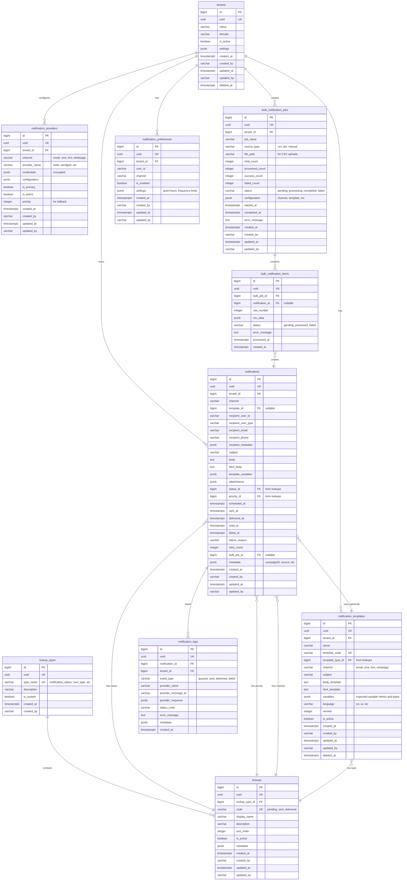

```mermaid
erDiagram
    tenants ||--o{ notification_templates : has
    tenants ||--o{ notification_providers : configures
    tenants ||--o{ notifications : owns
    tenants ||--o{ bulk_notification_jobs : creates
    tenants ||--o{ notification_preferences : has
    
    lookup_types ||--o{ lookups : contains
    
    notifications ||--o{ notification_logs : tracks
    notifications }o--|| notification_templates : "uses (optional)"
    notifications }o--|| lookups : "has status"
    notifications }o--|| lookups : "has priority"
    notifications }o--|| lookups : "has channel"
    
    bulk_notification_jobs ||--o{ bulk_notification_items : contains
    bulk_notification_items }o--|| notifications : creates
    
    notification_templates }o--|| lookups : "has type"
    
    tenants {
        bigint id PK
        uuid uuid UK
        varchar name
        varchar domain
        boolean is_active
        jsonb settings
        timestamptz created_at
        varchar created_by
        timestamptz updated_at
        varchar updated_by
        timestamptz deleted_at
    }
    
    lookup_types {
        bigint id PK
        uuid uuid UK
        varchar type_name UK "notification_status, user_type, etc"
        varchar description
        boolean is_system
        timestamptz created_at
        varchar created_by
    }
    
    lookups {
        bigint id PK
        uuid uuid UK
        bigint lookup_type_id FK
        varchar code UK "pending, sent, delivered"
        varchar display_name
        varchar description
        integer sort_order
        boolean is_active
        jsonb metadata
        timestamptz created_at
        varchar created_by
        timestamptz updated_at
        varchar updated_by
    }
    
    notification_templates {
        bigint id PK
        uuid uuid UK
        bigint tenant_id FK
        varchar name
        varchar template_code UK
        bigint template_type_id FK "from lookups"
        varchar channel "email, sms, fcm, whatsapp"
        varchar subject
        text body_template
        text html_template
        jsonb variables "expected variable names and types"
        varchar language "en, ar, etc"
        integer version
        boolean is_active
        timestamptz created_at
        varchar created_by
        timestamptz updated_at
        varchar updated_by
        timestamptz deleted_at
    }
    
    notification_providers {
        bigint id PK
        uuid uuid UK
        bigint tenant_id FK
        varchar channel "email, sms, fcm, whatsapp"
        varchar provider_name "twilio, sendgrid, etc"
        jsonb credentials "encrypted"
        jsonb configuration
        boolean is_primary
        boolean is_active
        integer priority "for fallback"
        timestamptz created_at
        varchar created_by
        timestamptz updated_at
        varchar updated_by
    }
    
    notifications {
        bigint id PK
        uuid uuid UK
        bigint tenant_id FK
        varchar channel
        bigint template_id FK "nullable"
        varchar recipient_user_id
        varchar recipient_user_type
        varchar recipient_email
        varchar recipient_phone
        jsonb recipient_metadata
        varchar subject
        text body
        text html_body
        jsonb template_variables
        jsonb attachments
        bigint status_id FK "from lookups"
        bigint priority_id FK "from lookups"
        timestamptz scheduled_at
        timestamptz sent_at
        timestamptz delivered_at
        timestamptz read_at
        timestamptz failed_at
        varchar failure_reason
        integer retry_count
        bigint bulk_job_id FK "nullable"
        jsonb metadata "campaignId, source, etc"
        timestamptz created_at
        varchar created_by
        timestamptz updated_at
        varchar updated_by
    }
    
    notification_logs {
        bigint id PK
        uuid uuid UK
        bigint notification_id FK
        bigint tenant_id FK
        varchar event_type "queued, sent, delivered, failed"
        varchar provider_name
        varchar provider_message_id
        jsonb provider_response
        varchar status_code
        text error_message
        jsonb metadata
        timestamptz created_at
    }
    
    bulk_notification_jobs {
        bigint id PK
        uuid uuid UK
        bigint tenant_id FK
        varchar job_name
        varchar source_type "csv, api, manual"
        varchar file_path "for CSV uploads"
        integer total_count
        integer processed_count
        integer success_count
        integer failed_count
        varchar status "pending, processing, completed, failed"
        jsonb configuration "channel, template, etc"
        timestamptz started_at
        timestamptz completed_at
        text error_message
        timestamptz created_at
        varchar created_by
        timestamptz updated_at
        varchar updated_by
    }
    
    bulk_notification_items {
        bigint id PK
        uuid uuid UK
        bigint bulk_job_id FK
        bigint notification_id FK "nullable"
        integer row_number
        jsonb csv_data
        varchar status "pending, processed, failed"
        text error_message
        timestamptz processed_at
        timestamptz created_at
    }
    
    notification_preferences {
        bigint id PK
        uuid uuid UK
        bigint tenant_id FK
        varchar user_id
        varchar channel
        boolean is_enabled
        jsonb settings "quiet hours, frequency limits"
        timestamptz created_at
        varchar created_by
        timestamptz updated_at
        varchar updated_by
    }
```